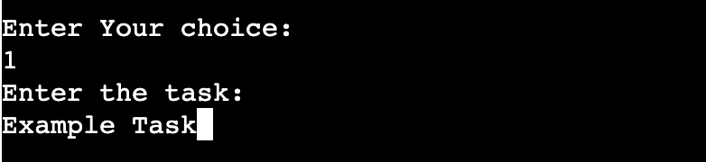
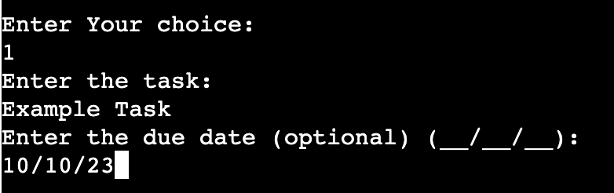
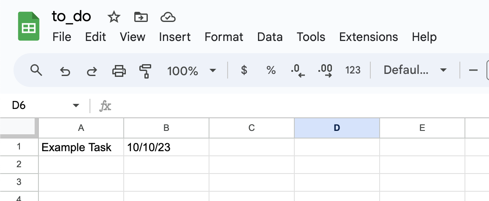
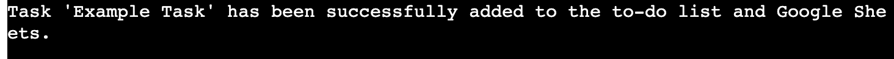
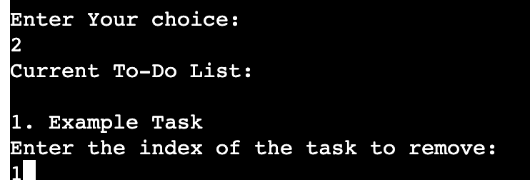
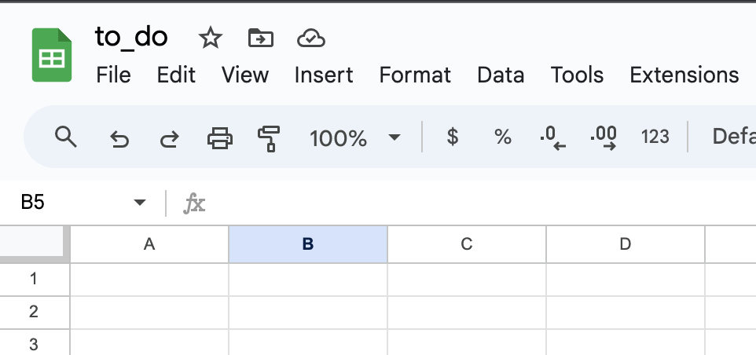
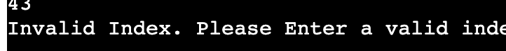

# To Do List

----

# Table of Contents

- [Repository](#repository)

# Repository 

[GitHub Repository](https://github.com/hypergeek-dev/cipher-forge)

Live at: [https://to-do-list-p3-d2dfb93e25e8.herokuapp.com/](https://to-do-list-p3-d2dfb93e25e8.herokuapp.com/)

# Introduction 
Welcome to the To-Do list which is a powerful task management tool which is  designed to help you keep track of your tasks and stay organized in your daily life.

# How To Use 
When you launch the application, you will be met with a welcome message and a menu of options. Select option 1 to add a task, then give a description (e.g., "Complete project report") and, optionally, a due date (e.g., "09/30/2023"). Your task will be put to your local to-do list and, is synchronised with Google Sheets. To delete a task, select option 2, enter the task's index, and it will be removed from your list and Google Sheets, if applicable. Option 3 displays your current tasks together with their indexes and due dates, allowing you to keep track of your to-do list. Finally, option 4 allows you to exit the application once you've completed your tasks management. 

# Features

## Welcome Message And Menu Feature
- When the user runs the To-Do list they are greeted with a welcome message and a interactive menu with four options to choose from:
    1. Add task
    2. Remove task
    3. Display To-Do List
    4. Quit
- Below the menu options the user will be prompted to input the number corresponding to what they want.

 
- When the user enters a number that is not between 1 and 4, it displays a message that says "Invalid choice, Please try again" and displays the welcome message and menu for the user to select again.
 

## Add Task Feature

- Add New Task: The application  will prompt the user to input the task you want to add.

- Add Optional Due Date: The application will also prompt the user to enter a due date for the task which is optional ; if no due date is entered, the task will be recorded as "No due date."

- Google Sheet Integration: Every task the user is not only saved locally but also be transferred to a google sheet document.

- Success Confirmation: After Adding a task the application will provide a confirmation message, so the user knows that the task has been added both locally and in Google Sheets.

- Error Handling: If any errors occur during adding a task, the application will catch and report them.

## Remove Task Feature

- Remove Task By Index: When the user selects the remove task option the application will display the users current to-do list with the task indices, which will help the user find the task they want to remove

- Google Sheets Integration: When the user removes a task it not only removes it from the local list but also google sheets.

- Success Confirmation: After removing a task from the local list and google sheets the application will provide aconfirmation message.

- Error Handling: If the user enters a wrong index a message will appear stating "Invaid Index" and if an unexpected error occurs the application will catch it and report it.

## Quit Feature

- When the user decides  to exit the application, they can do so by selecting the quit option, which ensures the user exits the application safely and efficiently and displays a confirmation message.

# Deployment 

This project was deployed using Code Institute’s mock terminal for Heroku.

Steps for deployment:
- Clone this

# Technologies Used

- Python
- gspread
- Google Sheets API
- Google OAuth2

# User Stories

- As a user, I want to be able to add tasks to my to-do list, including optional due dates, so I can keep track of my tasks efficiently.
- As a user, I want to remove tasks from my to-do list when they are completed or no longer relevant, ensuring my list stays up to date.
- As a user, I want to easily view my current to-do list, allowing me to see all the tasks I need to complete.
- As a user, I want the option to quit the program when I'm done using it, ensuring a smooth and convenient experience.

# Testing

- PEP8 
    - No errors were found using  https://www.pythonchecker.com/

- Bugs 
    - The first bug was in the remove task function, which was indentation of the try and except blocks this made the remove task function not work. I fixed this re reading the code an making sure the indention was correct
    - Another bug was the google spreadsheet not working so the tasks were not being updated to the worksheet since i forgot to input the email to the google sheet worksheet, the way i fixed was by rewatching love sandwiches project 

