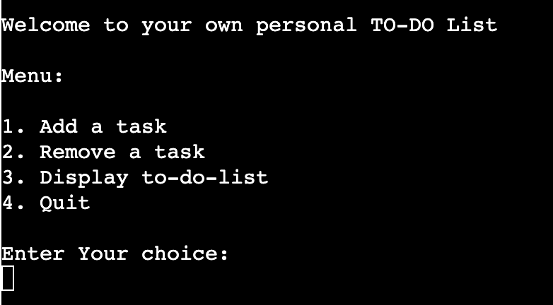
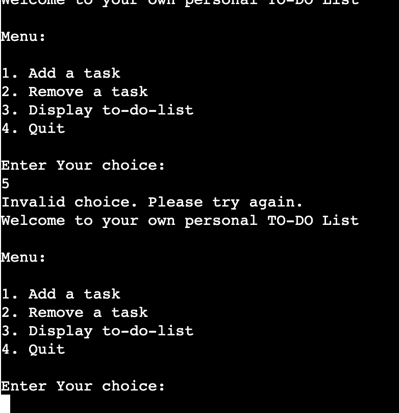

# To Do List

----

# Table of Contents

- [Repository](#repository)

# Repository 

[GitHub Repository]([GitHub Repository](https://github.com/hypergeek-dev/cipher-forge))

Live at: [https://to-do-list-p3-d2dfb93e25e8.herokuapp.com/](https://to-do-list-p3-d2dfb93e25e8.herokuapp.com/)

# Introduction 
Welcome to the To-Do list which is a powerful task management tool which is  designed to help you keep track of your tasks and stay organized in your daily life.

# How To Use 
When you launch the application, you will be met with a welcome message and a menu of options. Select option 1 to add a task, then give a description (e.g., "Complete project report") and, optionally, a due date (e.g., "09/30/2023"). Your task will be put to your local to-do list and, is synchronised with Google Sheets. To delete a task, select option 2, enter the task's index, and it will be removed from your list and Google Sheets, if applicable. Option 3 displays your current tasks together with their indexes and due dates, allowing you to keep track of your to-do list. Finally, option 4 allows you to exit the application once you've completed your tasks management. 

# Features

## Welcome Message And Menu
- When the user runs the To-Do list they are greeted with a welcome message and a interactive menu with four options to choose from:
    1. Add task
    2. Remove task
    3. Display To-Do List
    4. Quit
- Below the menu options the user will be prompted to input the number corresponding to what they want.

 
- When the user enters a number that is not between 1 and 4, it displays a message that says "Invalid choice, Please try again" and displays the welcome message and menu for the user to select again.
 

